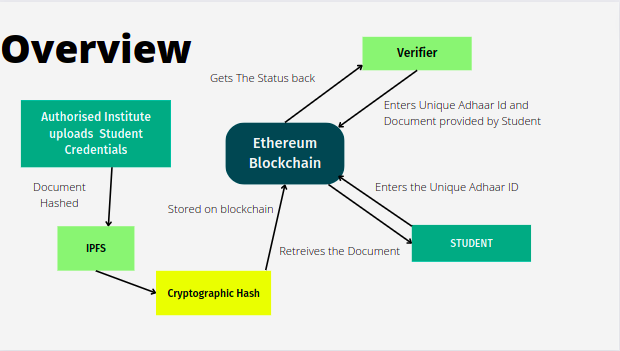

# Decentralised Document Verification--Dokify
A academic credential verification platform, made using blockchain technology, used to issue, manage and verify academic documents/credentials in a secure and distributed manner. This project addresses the need for a secure digital platform to issue and verify academic credentials without intervention from the original certificate issuer (University) and to make the system more transparent.


## Overview



## Features

- This application provides a tamper-proof platform to universities and autonomous colleges to publish the credentials and also to verify the marks memos submitted by the students to the employers.
- Only the authorized universities can add certificates into the blockchain.
- The credentials of the students are added along with roll number, name, and Aadhar number.
- Student could Retrieve his/her credentials using a unique Adhaar ID.
- Verification of certificate is done by uploading the hardcopy/softcopy provided by the institute.
- Any company/organisation etc. can verify the documents submitted by its stuents/employees.


## Network Users
Universities

- Only Authorised Universities could Issue certificates
Students

- Student can verify the certificate provided by University
- Receive certificate pdf using unique Adhaar ID
Verifier

- Receive certificate from students.
- Verify certificate authenticity with blockchain platform.
Admin

- Authorise a particular University using its Metamask Public Address.

Organisation
- Retrieves & verify the documents/credentials submitted by its students/employees.


## Tech Stack

**React :**  For creating frontend of webapp.  
**Css :** For decorating webapp.  
**Solidity :** For writing smart contracts.  
**Web3.js :** A javascript library to interact with on-chain components.  
**Truffle :** Development framework for testing and deploying smart contracts.  
**IPFS :** The InterPlanetary File System is a protocol and peer-to-peer network for storing and sharing data in a distributed file system.  
**Metamask :** A cryptocurrency wallet to interact with etherium blockchain and decentralised application.


## Run Locally

Clone the project

```bash
  git clone https://github.com/Jayant135/Web3Project.git
```

Go to the project directory

```bash
  cd project
```

Install dependencies

```bash
  npm install
```

Start the server

```bash
  npm run start
```

## Demo

**Register Institute**<br/>


**Store Credentials**<br/>


**Verify Credentials**<br/>

**Retrieve Credentials**<br/>


## Credits
Team Member - [Nitin Juyal](https://github.com/NitinJuyal1610)

